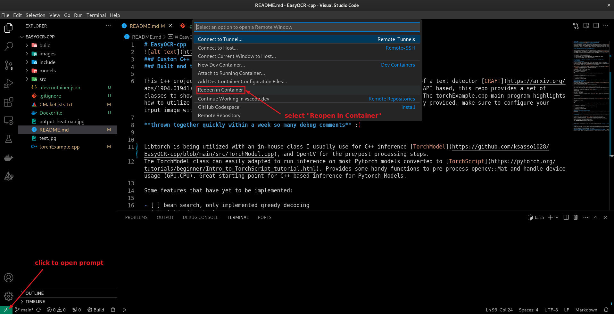

# EasyOCR-cpp

### Custom C++ implementation of [EasyOCR](https://github.com/JaidedAI/EasyOCR)
### Built and tested on Windows 11, libtorch 1.13+cpu and OpenCV 4.6

This C++ project implements the pre/post processing to run a OCR pipeline consisting of a text detector [CRAFT](https://arxiv.org/abs/1904.01941), and a CRNN based text recognizer. Unlike the EasyOCR python which is API based, this repo provides a set of classes to show how you can integrate OCR in any C++ program for maximum flexibility. The torchExample.cpp main program highlights how to utilize all elements of the EasyOCR-cpp pipeline. Because a test program is only provided, make sure to configure your input image within torchExample.cpp if you only plan to utilize the test program. 

**thrown together quickly within a week so many debug comments** :)


Libtorch is being utilized with an in-house class I usually use for C++ inference [TorchModel](https://github.com/ksasso1028/EasyOCR-cpp/blob/main/src/TorchModel.cpp), and OpenCV for the pre/post processing steps.
The TorchModel class can easily adapted to run inference on most Pytorch models converted to [TorchScript](https://pytorch.org/tutorials/beginner/Intro_to_TorchScript_tutorial.html). Provides some handy functions to pre process opencv::Mat and handle device usage (GPU,CPU). Great starting point for C++ based inference for Pytorch Models.

Some features that have yet to be implemented:

- [ ] beam search, only implemented greedy decoding
- [ ] .txt/.pdf output
- [ ] exact bounding box merge alg from EasyOCR, opted for custom one which is less complex
- [ ] support for other languages, atm only english is supported.


### If you would like to support feel free to make a PR, or a issue if you are having trouble.

## Setup with Docker (Thanks to [@BBO-repo](https://github.com/BBO-repo)

### Docker container with VSCode
To build and run through visual studio code, make sure the remote development extension is installed.<br>

The repository provides a .devcontainer.json which should allow you to directly reopen the cloned folder in a docker container using the bottom left icon and select `Reopen in container`as illustrated below


When the container is finally built, you can open a terminal and your working folder should be `/workspace/ocr-c++` as mentionned `.devcontainer.json` the field `"workspaceFolder": "/workspaces/ocr-c++"`. You should have the two folders:
- `thirdparty` containing the automatically downloaded libtorch library
- `EasyOCR-cpp` containing the code

You can proceed as usual to build the cmake project
```
mkdir -p /workspaces/ocr-c++/EasyOCR-cpp/build
cd /workspaces/ocr-c++/EasyOCR-cpp/build
cmake ..
make
```
The binaries should be available in `build` folder, to run the example application just run:
```
cd /workspaces/ocr-c++/EasyOCR-cpp/build
./torchTest
```

### Docker container with command line
Considering that the repository was cloned in the folder `/my/working/directory/EasyOCR-cpp` for illustration.
#### Build the docker container
Build a docker image named for example `ocr_engine` from the `Dockerfile` inside the `/my/working/directory/EasyOCR-cpp` directory.<br>
```
docker build --progress=plain -t ocr_engine /my/working/directory/EasyOCR-cpp
```
Build a container named for example `EasyOCR-cpp` from the `ocr_engine` generated image
```
docker create --name EasyOCR-cpp --mount type=bind,source=/my/working/directory/EasyOCR-cpp,target=/workspaces/ocr-c++/EasyOCR-cpp ocr_engine:latest
```
You can now start, stop or restart the generated `EasyOCR-cpp` container.<br>
From a terminal, enter the following command to start the container and getting a terminal inside the container with an interactive mode
```
docker container start EasyOCR-cpp
docker exec -ti EasyOCR-cpp bash
```
You should have a bash terminal inside the container, entering `pwd` and `ls` commands should output the following:
```
pwd
  /workspaces/ocr-c++
ls
  thirdparty EasyOCR-cpp
```
Similarly to previously to build cmake project, go to source code folder `cd /workspaces/ocr-c++/EasyOCR-cpp`, make a folder `build` and go inside, then `cmake ..` and `make`
```
cd /workspaces/ocr-c++/EasyOCR-cpp
mkdir build
cd build
cmake ..
make
```
Then similarly, the binaries should be available in `build` folder, to run the example application just run:
```
cd /workspaces/ocr-c++/EasyOCR-cpp/build
./torchTest
```

## Setup to run without Docker

### Dependencies
Click to Download libtorch - > [download](https://download.pytorch.org/libtorch/cpu/libtorch-win-shared-with-deps-1.13.1%2Bcpu.zip)

Use OpenCV Windows installer and unzip (v4.6) - > [OpenCV libs](https://opencv.org/releases/)

Make sure to change the location in the  [Makefile](https://github.com/ksasso1028/EasyOCR-cpp/blob/e9311ee3f45b59c2709be3a98a04b48c215a845b/CMakeLists.txt#L7) for OpenCV to point to your OpenCV build dir 

Create a build directory within the repo, cd to it and run
```
cmake -DCMAKE_PREFIX_PATH=<absolute-path-to-libtorch-folder> ..
```


This will generate a solution within the build folder you can open up in Visual Studio. **Make sure to use the Release config when building**

### Running

Configure your input image  [here](https://github.com/ksasso1028/EasyOCR-cpp/blob/e9311ee3f45b59c2709be3a98a04b48c215a845b/torchExample.cpp#L25). Currently the test program is using the test.jpg which comes in the repo.

Launch from command-line, or within Visual Studio after building.

**Since its designed to be used in a C++ program, text is not being written to disk at the moment** An output image will be generated in the main repo dir containing an annotated version of the input image with detection bounding boxes


